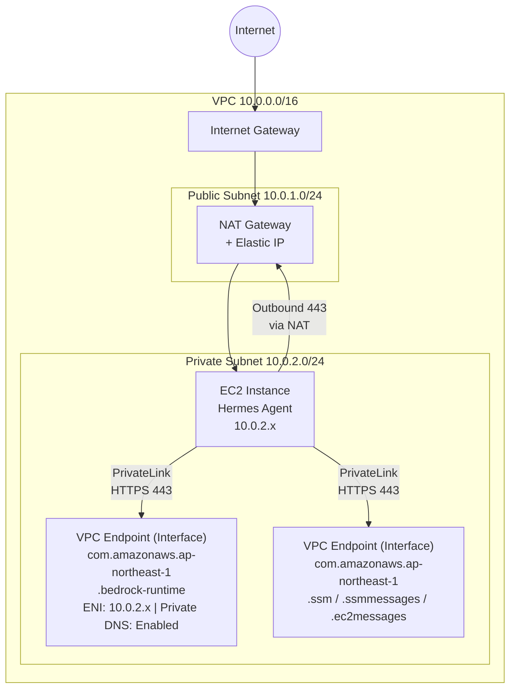

# Hermes Agent Network Architecture

## VPC Design

| Item | Value |
|------|------|
| Region | ap-northeast-1 (Tokyo) |
| VPC CIDR | 10.0.0.0/16 |
| DNS Hostnames | Enabled |
| DNS Support | Enabled |

> The following is the default configuration. Region and CIDR can be adjusted via Terraform variables (`aws_region`, `vpc_cidr`).

## Subnet Layout

| Subnet | CIDR | AZ | Purpose |
|--------|------|------|---------|
| Public Subnet | 10.0.1.0/24 | ap-northeast-1a | NAT Gateway |
| Private Subnet | 10.0.2.0/24 | ap-northeast-1a | EC2 Instance, VPC Endpoints |

> Single AZ design: A personal assistant project does not require multi-AZ redundancy, saving NAT Gateway costs.

## Network Topology



## Route Tables

### Public Subnet Route Table

| Destination | Target |
|-------------|--------|
| 10.0.0.0/16 | local |
| 0.0.0.0/0 | Internet Gateway |

### Private Subnet Route Table

| Destination | Target |
|-------------|--------|
| 10.0.0.0/16 | local |
| 0.0.0.0/0 | NAT Gateway |

## Security Groups

### EC2 Security Group (`hermes-agent-sg`)

| Direction | Protocol | Port | Source/Dest | Purpose |
|-----------|----------|------|-------------|---------|
| Outbound | All | All | 0.0.0.0/0 | All external communication (Telegram API, package downloads, etc.) |
| Inbound | — | — | — | **No inbound rules** |

> EC2 does not require any inbound connections. Telegram uses Long Polling (Outbound HTTPS). Management access is via SSM Session Manager.

### VPC Endpoint Security Group (`vpce-bedrock-sg`)

| Direction | Protocol | Port | Source/Dest | Purpose |
|-----------|----------|------|-------------|---------|
| Inbound | TCP | 443 | hermes-agent-sg | Accept HTTPS requests from EC2 |
| Outbound | — | — | — | No additional outbound needed |

### VPC Endpoint Security Group (`vpce-ssm-sg`)

| Direction | Protocol | Port | Source/Dest | Purpose |
|-----------|----------|------|-------------|---------|
| Inbound | TCP | 443 | hermes-agent-sg | Accept SSM API requests from EC2 |
| Outbound | — | — | — | No additional outbound needed |

## VPC Endpoints

| Endpoint | Service Name | Type | Private DNS | Purpose |
|----------|-------------|------|-------------|---------|
| Bedrock Runtime | `com.amazonaws.ap-northeast-1.bedrock-runtime` | Interface | Enabled | AI model inference |
| SSM | `com.amazonaws.ap-northeast-1.ssm` | Interface | Enabled | Read secret parameters |
| SSM Messages | `com.amazonaws.ap-northeast-1.ssmmessages` | Interface | Enabled | Session Manager connections |
| EC2 Messages | `com.amazonaws.ap-northeast-1.ec2messages` | Interface | Enabled | SSM Agent communication |

## Traffic Path Analysis

### 1. Telegram API Communication

```
EC2 → Private Subnet Route Table → NAT Gateway → IGW → Internet → api.telegram.org
```

- Uses the NAT Gateway's Elastic IP as the source IP
- Outbound HTTPS (443) only

### 2. Bedrock API Calls

```
EC2 → VPC Endpoint ENI (Private DNS: bedrock-runtime.ap-northeast-1.amazonaws.com)
     → AWS PrivateLink → Bedrock Service
```

- Traffic stays entirely within the AWS network, never traversing the public internet
- With Private DNS enabled, the SDK automatically routes to the VPC Endpoint

### 3. SSM Parameter Store Access

```
EC2 → VPC Endpoint ENI (Private DNS: ssm.ap-northeast-1.amazonaws.com)
     → AWS PrivateLink → SSM Service
```

### 4. Management Access (SSH Alternative)

```
Administrator → AWS Console/CLI → SSM Session Manager → EC2
```

- **SSH (Port 22) is not exposed**
- Remote management via SSM Session Manager
- Requires ssmmessages and ec2messages VPC Endpoints

## Security Design Principles

1. **Zero Inbound**: EC2 accepts no external inbound traffic
2. **Private Subnet**: EC2 has no public IP, accesses external services only via NAT Gateway
3. **PrivateLink**: Bedrock and SSM calls do not traverse the public internet
4. **Open Egress**: Security Group allows all outbound traffic (installation and operation require multiple protocols)
5. **No SSH**: Management via SSM Session Manager, no need to open Port 22
6. **VPC Flow Logs**: Enabled to record all network traffic for auditing

## Cost Considerations

| Component | Estimated Monthly Cost (USD) |
|-----------|------------------------------|
| NAT Gateway | ~$45 + data transfer |
| VPC Endpoint (x4) | ~$41 (~$10.2/month each) |
| Elastic IP | $3.65 |

> For detailed cost analysis, see [deployment-guide.md](deployment-guide.md#cost-analysis).
