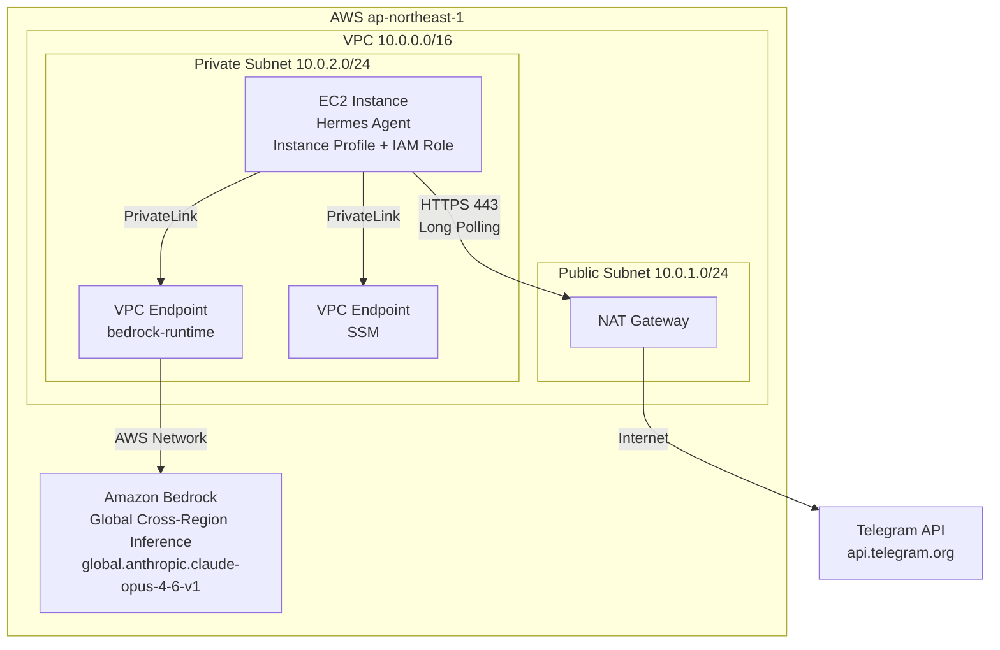

# Hermes Agent System Architecture

## Overview

Hermes Agent is a Telegram personal assistant deployed on AWS EC2, using Amazon Bedrock Claude Opus 4.6 as the AI inference engine. The system is deployed in the `ap-northeast-1` (Tokyo) region, with infrastructure managed as code (IaC) via Terraform.

> The following describes the default configuration. Region, model, instance type, etc. can all be adjusted via Terraform variables. See [Deployment Guide — Terraform Variable Configuration](deployment-guide.md#terraform-variable-configuration) for details.

## System Components



## Core Component Details

### 1. EC2 Instance (Hermes Agent)

| Item | Specification |
|------|------|
| Instance Type | `t4g.xlarge` (default, adjustable via `instance_type` variable) |
| AMI | Amazon Linux 2023 (ARM64, latest) |
| Subnet | Private Subnet |
| Public IP | None (accesses external services via NAT Gateway) |
| Storage | gp3 EBS, default 100GB (adjustable via `ebs_volume_size`), encrypted |

### 2. Amazon Bedrock Claude Opus 4.6

| Item | Value |
|------|------|
| Model ID (Base) | `anthropic.claude-opus-4-6-v1` |
| Inference Profile (Global) | `global.anthropic.claude-opus-4-6-v1` |
| ap-northeast-1 Availability | Global Cross-Region Inference only |
| Context Window | 1M tokens |
| Max Output | 128K tokens |

**Important Note**: Claude Opus 4.6 does not support In-Region inference in ap-northeast-1. You must use the Global Cross-Region Inference profile (`global.anthropic.claude-opus-4-6-v1`). Requests are routed through the AWS global network to regions where the model is available.

### 3. VPC Endpoint (PrivateLink)

- Service Name: `com.amazonaws.ap-northeast-1.bedrock-runtime`
- Type: Interface Endpoint
- Private DNS: Enabled
- Purpose: EC2 calls Bedrock API without traversing the public internet

### 4. Telegram Connection Mode

Uses **Long Polling** mode:
- EC2 initiates HTTPS requests to the Telegram API
- No inbound connections required; no public IP or Load Balancer needed
- Accesses Telegram API (`api.telegram.org`) via NAT Gateway

## IAM Permission Design (Least Privilege Principle)

### EC2 Instance Role Policy

```json
{
  "Version": "2012-10-17",
  "Statement": [
    {
      "Sid": "BedrockInvoke",
      "Effect": "Allow",
      "Action": [
        "bedrock:InvokeModel",
        "bedrock:InvokeModelWithResponseStream",
        "bedrock:ListFoundationModels",
        "bedrock:ListInferenceProfiles"
      ],
      "Resource": "*"
    },
    {
      "Sid": "SSMAccess",
      "Effect": "Allow",
      "Action": [
        "ssm:GetParameter",
        "ssm:GetParameters"
      ],
      "Resource": "arn:aws:ssm:<region>:*:parameter/hermes-agent/*"
    }
  ]
}
```

### Trust Policy

```json
{
  "Version": "2012-10-17",
  "Statement": [
    {
      "Effect": "Allow",
      "Principal": {
        "Service": "ec2.amazonaws.com"
      },
      "Action": "sts:AssumeRole"
    }
  ]
}
```

## Secrets Management

| Secret | Storage Location | Description |
|--------|------------------|-------------|
| Telegram Bot Token | SSM Parameter Store (SecureString) | KMS encrypted |
| Other API Keys | SSM Parameter Store (SecureString) | Added as needed |

Secrets are **never** stored in `.env` files or hardcoded.

## Runtime Flow

1. On EC2 startup, User Data installs Hermes Agent and creates the `hermes` unprivileged user
2. User Data reads the Telegram Bot Token from SSM Parameter Store and writes it to `~/.hermes/.env`
3. Hermes Gateway starts as a systemd service, running as the `hermes` user
4. The agent connects to the Telegram API in Long Polling mode
5. Upon receiving a user message, it calls Bedrock Claude Opus 4.6 via the VPC Endpoint
6. The AI response is sent back to Telegram

## High Availability Considerations

This is a personal assistant project using a single EC2 instance deployment. For high availability:
- Add an Auto Scaling Group (min=1, max=1) for automatic recovery
- Combine with CloudWatch Alarms to monitor instance health
