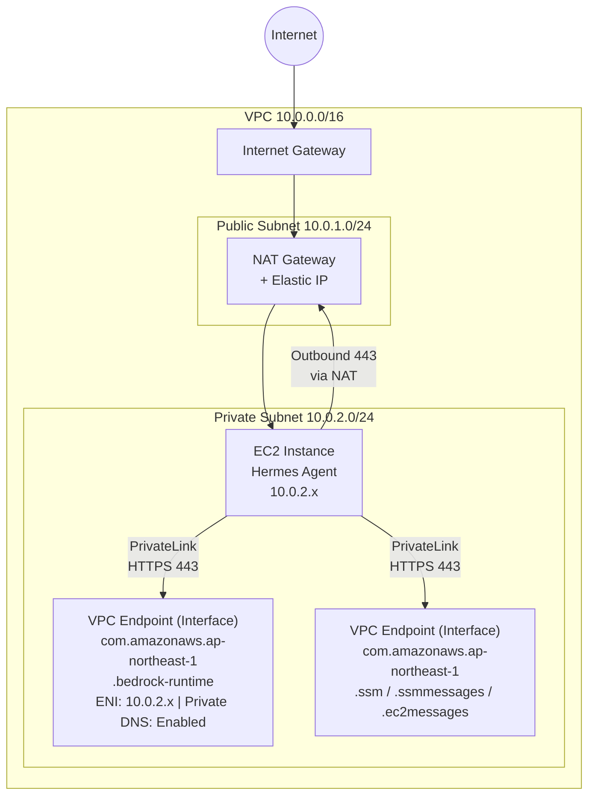

# Hermes Agent 網路架構

## VPC 設計

| 項目 | 值 |
|------|------|
| Region | ap-northeast-1 (Tokyo) |
| VPC CIDR | 10.0.0.0/16 |
| DNS Hostnames | 啟用 |
| DNS Support | 啟用 |

> 以下為預設配置，區域和 CIDR 可透過 Terraform 變數 (`aws_region`, `vpc_cidr`) 調整。

## 子網規劃

| 子網 | CIDR | AZ | 用途 |
|------|------|------|------|
| Public Subnet | 10.0.1.0/24 | ap-northeast-1a | NAT Gateway |
| Private Subnet | 10.0.2.0/24 | ap-northeast-1a | EC2 Instance, VPC Endpoints |

> 單一 AZ 設計：個人助理專案不需要多 AZ 冗餘，節省 NAT Gateway 費用。

## 網路拓撲



## 路由表

### Public Subnet Route Table

| Destination | Target |
|-------------|--------|
| 10.0.0.0/16 | local |
| 0.0.0.0/0 | Internet Gateway |

### Private Subnet Route Table

| Destination | Target |
|-------------|--------|
| 10.0.0.0/16 | local |
| 0.0.0.0/0 | NAT Gateway |

## Security Groups

### EC2 Security Group (`hermes-agent-sg`)

| 方向 | Protocol | Port | Source/Dest | 用途 |
|------|----------|------|-------------|------|
| Outbound | All | All | 0.0.0.0/0 | 所有外部通訊 (Telegram API, 套件下載等) |
| Inbound | — | — | — | **無任何 Inbound 規則** |

> EC2 不需要任何 Inbound 連線。Telegram 使用 Long Polling (Outbound HTTPS)。管理存取透過 SSM Session Manager。

### VPC Endpoint Security Group (`vpce-bedrock-sg`)

| 方向 | Protocol | Port | Source/Dest | 用途 |
|------|----------|------|-------------|------|
| Inbound | TCP | 443 | hermes-agent-sg | 接受來自 EC2 的 HTTPS 請求 |
| Outbound | — | — | — | 無需額外 Outbound |

### VPC Endpoint Security Group (`vpce-ssm-sg`)

| 方向 | Protocol | Port | Source/Dest | 用途 |
|------|----------|------|-------------|------|
| Inbound | TCP | 443 | hermes-agent-sg | 接受來自 EC2 的 SSM API 請求 |
| Outbound | — | — | — | 無需額外 Outbound |

## VPC Endpoints

| Endpoint | 服務名稱 | 類型 | Private DNS | 用途 |
|----------|----------|------|-------------|------|
| Bedrock Runtime | `com.amazonaws.ap-northeast-1.bedrock-runtime` | Interface | 啟用 | AI 模型推論 |
| SSM | `com.amazonaws.ap-northeast-1.ssm` | Interface | 啟用 | 讀取機密參數 |
| SSM Messages | `com.amazonaws.ap-northeast-1.ssmmessages` | Interface | 啟用 | Session Manager 連線 |
| EC2 Messages | `com.amazonaws.ap-northeast-1.ec2messages` | Interface | 啟用 | SSM Agent 通訊 |

## 流量路徑分析

### 1. Telegram API 通訊

```
EC2 → Private Subnet Route Table → NAT Gateway → IGW → Internet → api.telegram.org
```

- 使用 NAT Gateway 的 Elastic IP 作為來源 IP
- 僅 Outbound HTTPS (443)

### 2. Bedrock API 呼叫

```
EC2 → VPC Endpoint ENI (Private DNS: bedrock-runtime.ap-northeast-1.amazonaws.com)
     → AWS PrivateLink → Bedrock Service
```

- 流量完全在 AWS 網路內，不經過公網
- Private DNS 啟用後，SDK 自動路由到 VPC Endpoint

### 3. SSM Parameter Store 存取

```
EC2 → VPC Endpoint ENI (Private DNS: ssm.ap-northeast-1.amazonaws.com)
     → AWS PrivateLink → SSM Service
```

### 4. 管理存取 (SSH 替代方案)

```
管理員 → AWS Console/CLI → SSM Session Manager → EC2
```

- **不開放 SSH (Port 22)**
- 透過 SSM Session Manager 進行遠端管理
- 需要 ssmmessages 和 ec2messages VPC Endpoints

## 安全設計原則

1. **零 Inbound**: EC2 不接受任何外部連入流量
2. **Private Subnet**: EC2 無公網 IP，僅透過 NAT Gateway 存取外部
3. **PrivateLink**: Bedrock 和 SSM 呼叫不經過公網
4. **Egress 全開**: Security Group 允許所有 Outbound 流量 (安裝和運行需要多種協議)
5. **無 SSH**: 管理透過 SSM Session Manager，無需開放 Port 22
6. **VPC Flow Logs**: 啟用以記錄所有網路流量供審計

## 成本考量

| 元件 | 預估月費 (USD) |
|------|---------------|
| NAT Gateway | ~$45 + 資料傳輸 |
| VPC Endpoint (x4) | ~$41 (每個 ~$10.2/月) |
| Elastic IP | $3.65 |

> 詳細成本分析見 [deployment-guide.md](deployment-guide.md#成本分析)。
