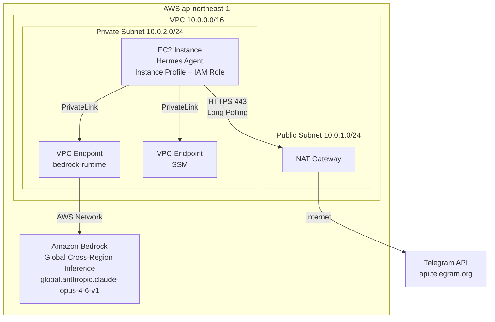

# Hermes Agent 系統架構

## 概述

Hermes Agent 是一個部署在 AWS EC2 上的 Telegram 個人助理，使用 Amazon Bedrock Claude Opus 4.6 作為 AI 推論引擎。系統部署在 `ap-northeast-1` (東京) 區域，透過 Terraform 實現基礎設施即代碼 (IaC)。

> 以下描述為預設配置。區域、模型、機型等均可透過 Terraform 變數調整，詳見 [部署流程 — Terraform 變數配置](deployment-guide.md#terraform-變數配置)。

## 系統元件



## 核心元件說明

### 1. EC2 Instance (Hermes Agent)

| 項目 | 規格 |
|------|------|
| 實例類型 | `t4g.xlarge` (預設，可透過 `instance_type` 變數調整) |
| AMI | Amazon Linux 2023 (ARM64, 最新版) |
| 子網 | Private Subnet |
| 公網 IP | 無 (透過 NAT Gateway 存取外部) |
| 儲存 | gp3 EBS, 預設 100GB (可透過 `ebs_volume_size` 調整), 加密 |

### 2. Amazon Bedrock Claude Opus 4.6

| 項目 | 值 |
|------|------|
| Model ID (Base) | `anthropic.claude-opus-4-6-v1` |
| Inference Profile (Global) | `global.anthropic.claude-opus-4-6-v1` |
| ap-northeast-1 可用性 | 僅 Global Cross-Region Inference |
| Context Window | 1M tokens |
| Max Output | 128K tokens |

**重要說明**: Claude Opus 4.6 在 ap-northeast-1 不支援 In-Region 推論，必須使用 Global Cross-Region Inference profile (`global.anthropic.claude-opus-4-6-v1`)。請求會透過 AWS 全球網路路由到有該模型的區域。

### 3. VPC Endpoint (PrivateLink)

- 服務名稱: `com.amazonaws.ap-northeast-1.bedrock-runtime`
- 類型: Interface Endpoint
- Private DNS: 啟用
- 用途: EC2 呼叫 Bedrock API 不經過公網

### 4. Telegram 連線模式

採用 **Long Polling** 模式：
- EC2 主動向 Telegram API 發起 HTTPS 請求
- 不需要 Inbound 連線，無需公網 IP 或 Load Balancer
- 透過 NAT Gateway 存取 Telegram API (`api.telegram.org`)

## IAM 權限設計 (最小權限原則)

### EC2 Instance Role Policy

```json
{
  "Version": "2012-10-17",
  "Statement": [
    {
      "Sid": "BedrockInvoke",
      "Effect": "Allow",
      "Action": [
        "bedrock:InvokeModel",
        "bedrock:InvokeModelWithResponseStream",
        "bedrock:ListFoundationModels",
        "bedrock:ListInferenceProfiles"
      ],
      "Resource": "*"
    },
    {
      "Sid": "SSMAccess",
      "Effect": "Allow",
      "Action": [
        "ssm:GetParameter",
        "ssm:GetParameters"
      ],
      "Resource": "arn:aws:ssm:<region>:*:parameter/hermes-agent/*"
    }
  ]
}
```

### Trust Policy

```json
{
  "Version": "2012-10-17",
  "Statement": [
    {
      "Effect": "Allow",
      "Principal": {
        "Service": "ec2.amazonaws.com"
      },
      "Action": "sts:AssumeRole"
    }
  ]
}
```

## 機密管理

| 機密項目 | 儲存位置 | 說明 |
|----------|----------|------|
| Telegram Bot Token | SSM Parameter Store (SecureString) | KMS 加密 |
| 其他 API Keys | SSM Parameter Store (SecureString) | 按需新增 |

**不使用** `.env` 文件或硬編碼方式儲存機密。

## 運行模式

1. EC2 啟動時透過 User Data 安裝 Hermes Agent 並建立 `hermes` 非特權用戶
2. User Data 從 SSM Parameter Store 讀取 Telegram Bot Token 寫入 `~/.hermes/.env`
3. Hermes Gateway 以 systemd service 啟動，以 `hermes` 用戶運行
4. Agent 以 Long Polling 模式連接 Telegram API
5. 收到用戶訊息後，透過 VPC Endpoint 呼叫 Bedrock Claude Opus 4.6
6. 將 AI 回覆傳送回 Telegram

## 高可用性考量

此為個人助理專案，採用單一 EC2 實例部署。如需高可用：
- 可加入 Auto Scaling Group (min=1, max=1) 實現自動恢復
- 搭配 CloudWatch Alarm 監控實例健康狀態
